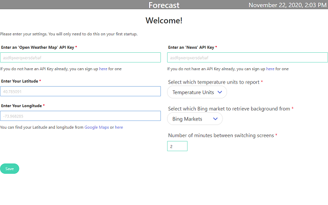

# Weather Dashboard

A Small Dashboard program to show weather information.   
Best to run in a device like the raspberry pi on an old monitor to display your local weather info.


# Requirements for use
1. You need to have an API Key from Open Weather Map.
   1. They are free and can be obtained from here: [https://openweathermap.org/appid#signup](https://openweathermap.org/appid#signup)
1. You need to know your latitude and longitude
   1. They can be found here: [https://latitudeandlongitude.org/](https://latitudeandlongitude.org/)
1. You need to have an API Key from [News API](https://newsapi.org/)
   1. Its free and can be obtained from here: [https://newsapi.org/register](https://newsapi.org/register)

# Usage
Once the required values are retrieved, enter them on the initial settings page and click 'Save'.   
If you don't want to (or can't) connect a keyboard/mouse, go to port 3000 on the device to access a web version of the settings.   
Ex: [http://raspberrypi:3000](http://raspberrypi:3000)   
All values need to be selected before saving.   
   
If you want to change a setting later on, simply right click anywhere in the app, and select 'Update Settings'.   
Or re-visit the port 3000 of the device.   
To close the app, right click and select 'Close Program'.   

# Quick start

Make sure you have [Node.js](https://nodejs.org) installed, then type the following commands known to every Node developer...
```
git clone https://github.com/Arges86/weather-dashboard.git
cd weather-dashboard
npm install
npm start
```
...and you have a running desktop application on your screen.

# Structure of the project

The application consists of two main folders...

`src` - files within this folder get transpiled or compiled (because Electron can't use them directly).

`app` - contains all static assets which don't need any pre-processing. Put here images, CSSes, HTMLs, etc.

The build process compiles the content of the `src` folder and puts it into the `app` folder, so after the build has finished, your `app` folder contains the full, runnable application.

Treat `src` and `app` folders like two halves of one bigger thing.

# Development

## Starting the app

```
npm start
```

## The build pipeline

Build process uses [Webpack](https://webpack.js.org/). The entry-points are `src/background.js` and `src/app.js`. Webpack will follow all `import` statements starting from those files and compile code of the whole dependency tree into one `.js` file for each entry point.

[Babel](http://babeljs.io/) is also utilised, but mainly for its great error messages. Electron under the hood runs latest Chromium, hence most of the new JavaScript features are already natively supported.

## Environments

Environmental variables are done in a bit different way (not via `process.env`). Env files are plain JSONs in `config` directory, and build process dynamically links one of them as an `env` module. You can import it wherever in code you need access to the environment.
```js
import env from "env";
console.log(env.name);
```

# Making a release

To package your app into an installer use command:
```
npm run release
```

Once the packaging process finished, the `dist` directory will contain your distributable file.

We use [electron-builder](https://github.com/electron-userland/electron-builder) to handle the packaging process. It has a lot of [customization options](https://www.electron.build/configuration/configuration), which you can declare under `"build"` key in `package.json`.

You can package your app cross-platform from a single operating system, [electron-builder kind of supports this](https://www.electron.build/multi-platform-build), but there are limitations and asterisks. That's why this boilerplate doesn't do that by default.
